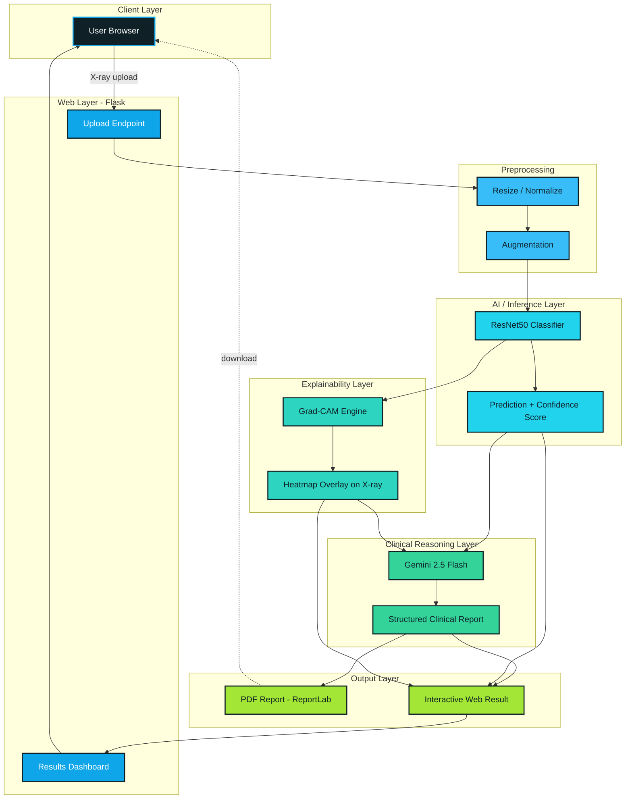

<p align="center">
  
</p>

# PNEUMONIA.AI

**Explainable AI for Pneumonia Detection from Chest X-Rays**


<p align="center">
  
</p>

---

## Overview

PNEUMONIA.AI is a medical imaging system that detects pneumonia from chest X-rays using deep learning, with explainability built into its core rather than added as an afterthought.

Instead of returning a single black-box prediction, the system shows **where** in the lung the model is focusing and **why**, using Grad-CAM heatmaps, and generates a doctor-readable clinical report from the result — reducing diagnosis time and improving clinical trust in the output.

**Design principle:** *AI should not just predict — it should explain.*

---

## Key Capabilities

- **Explainable, not just accurate** — Grad-CAM heatmaps localize the lung regions driving each prediction.
- **Clinically-oriented pipeline** — A ResNet50 classifier is paired with an LLM-based report generator to produce structured, doctor-ready summaries.
- **End-to-end web experience** — Upload an X-ray → get a prediction → get a visual explanation → download a PDF report.
- **Built for clinical trust** — Every prediction is paired with visual and textual justification instead of a bare label.

---

## System Design

### Architecture



**Data flow, step by step:**

1. **Upload** - The user submits a chest X-ray through the Flask web interface.
2. **Preprocess** - The image is resized, normalized, and optionally augmented for consistent model input.
3. **Classify** - ResNet50 predicts *Pneumonia* or *Normal* with an associated confidence score.
4. **Explain** - Grad-CAM back-propagates gradients from the final convolutional layer to produce a heatmap, which is overlaid on the original X-ray.
5. **Reason** - The prediction, confidence score, and heatmap context are passed to Gemini 2.5 Flash, which drafts a structured clinical narrative.
6. **Deliver** - The dashboard renders the prediction, heatmap, and report inline, while ReportLab packages everything into a downloadable PDF.

### Component Breakdown

| Layer | Responsibility | Key Technology |
|---|---|---|
| **Input Layer** | Accepts and validates chest X-ray uploads | Flask, OpenCV |
| **Preprocessing Layer** | Resizes, normalizes, and augments images for inference | OpenCV, NumPy |
| **Classification Layer** | Predicts pneumonia vs. normal from image features | ResNet50 (TensorFlow/Keras) |
| **Explainability Layer** | Generates Grad-CAM attention maps over the input image | TensorFlow, OpenCV, Matplotlib |
| **Reporting Layer** | Converts prediction + visual evidence into a clinical narrative | Gemini 2.5 Flash API |
| **Output Layer** | Renders results in-browser and as a downloadable report | Flask, ReportLab |

### Why ResNet50

Deep CNNs are prone to vanishing gradients as depth increases. ResNet50 mitigates this through residual learning, which lets the network skip a layer's transformation when it isn't useful:

```
H(x) = F(x) + x
```

This residual connection allows the network to:
- Train deeper feature extractors reliably
- Learn subtler patterns in lung tissue
- Capture fine-grained abnormalities that shallower CNNs miss

### Why Grad-CAM

Grad-CAM (Gradient-weighted Class Activation Mapping) traces the classifier's gradients back to the final convolutional layer to produce a heatmap of "where the model looked." This turns a single prediction into a visually verifiable claim — a radiologist can immediately see whether the model's attention aligns with the actual region of concern.

---

## Why This Approach Matters

| Traditional black-box systems | PNEUMONIA.AI |
|---|---|
| Opaque predictions | Transparent, traceable predictions |
| No visual justification | Grad-CAM heatmap on every result |
| Difficult to audit clinically | Interpretable, review-ready output |
| Raw label only | Structured, AI-generated clinical report |

---

## Tech Stack

- **Language:** Python 3.11
- **Modeling:** TensorFlow / Keras (ResNet50)
- **Explainability:** OpenCV, Grad-CAM
- **Data / Numerics:** NumPy, Matplotlib, Scikit-learn
- **Backend:** Flask
- **LLM Reporting:** Gemini 2.5 Flash API
- **Document Generation:** ReportLab (PDF)

---

## Model Evaluation

Performance is assessed using standard classification metrics:

- Accuracy
- Precision / Recall
- ROC Curve
- AUC Score

**Interpretation guide:**
- AUC → 1.0 indicates a highly discriminative model
- AUC → 0.5 indicates performance no better than random guessing

Grad-CAM outputs are evaluated qualitatively alongside these metrics — a well-performing model should localize attention over clinically relevant lung regions, not incidental image artifacts.

---

## Real-World Applications

- Radiology departments seeking a second-opinion / triage tool
- Doctors in under-resourced or rural settings without on-site radiologists
- Emergency diagnostic workflows requiring rapid triage
- Medical research institutions studying interpretable diagnostic AI

---

## Roadmap

- [ ] Multi-disease detection (tuberculosis, COVID-19)
- [ ] DICOM medical image format support
- [ ] Mobile diagnostic application
- [ ] Cloud GPU deployment for scalable inference
- [ ] Hospital information system (HIS) integration

---

## About the Author

<p align="center">
  
</p>

**Biswajit Pattanaik**
B.Tech, Electronics & Communication Engineering — Centurion University
AI & Embedded Systems Developer

Biswajit designed and built PNEUMONIA.AI end-to-end — from data preprocessing and model training, through the Grad-CAM explainability pipeline, to the Flask web interface and automated PDF reporting. The project reflects a deliberate design philosophy: an AI system intended for clinical use should never be a black box, and every prediction it makes should come with visual and written evidence a doctor can independently verify.

**Connect / Contribute:**
- ⭐ If this project helped you, a star means a lot and helps others discover it.
- 🐛 Found a bug or have an improvement in mind? Open an issue.
- 🤝 Interested in collaborating or extending the project? Pull requests and discussions are welcome.

<p align="center">
  
</p>
